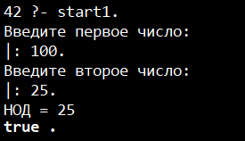
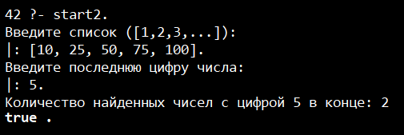
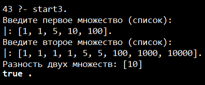
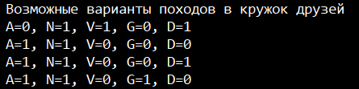

# Радостев Павел ИТС-2 Лабораторная №5

# Задание 1

## Задача 1

### Текст задачи

Составить программу вычисления наибольшего общего делителя двух натуральных чисел

### Алгоритм решения

1. Запросить ввод натуральных чисел
2. Произвести вычисления функцией НОДа
3. Вывести полученный результат

### Тестирование

# Задание 2

## Задача 1

### Текст задачи

В списке натуральных чисел подсчитать их количество, оканчивающихся заданной цифрой

### Алгоритм решения

1. Запросить ввод списка
2. Запросить ввод цифры для нахождения в конце числа
3. Пройти по каждому элементу списка, сверяя цифру в конце числа с искомой
4. Вывести количество найденных чисел

### Тестирование

# Задание 3

## Задача 1

### Текст задачи

Определим множество как список без повторяющихся элементов. Найти пересечение множеств

### Алгоритм решения

1. Запросить ввод двух списков
2. Избавиться от повторяющихся элементов в списках
3. Сравнить элементы первого списка с каждым элементом второго списка. Если совпало, удалить
4. Вывести полученную разность множеств

### Тестирование

# Задание 4

## Задача 1

### Текст задачи

Задача «Пятеро друзей».
Пятеро друзей решили записаться в кружок любителей логических задач:
Андрей (А), Николай (N), Виктор (V), Григорий (G), Дмитрий (D).
Но староста кружка поставил им ряд условий: «Вы должны приходить к нам
так, чтобы:
1) если А приходит вместе с D, то N должен присутствовать обязательно;
2) если D отсутствует, то N должен быть, а V пусть не приходит;
3) А и V не могут одновременно ни присутствовать, ни отсутствовать;
4) если придет D, то G пусть не приходит;
5) если N отсутствует, то D должен присутствовать, но это в том случае, если не
присутствует V;
6) если же и V присутствует при отсутствии N, то D приходить не должен, a G
должен прийти».
В каком составе друзья смогут прийти на занятия кружка?

### Алгоритм решения

1. Составить все логические выражения
2. Вывести все подходящие результаты

### Тестирование

